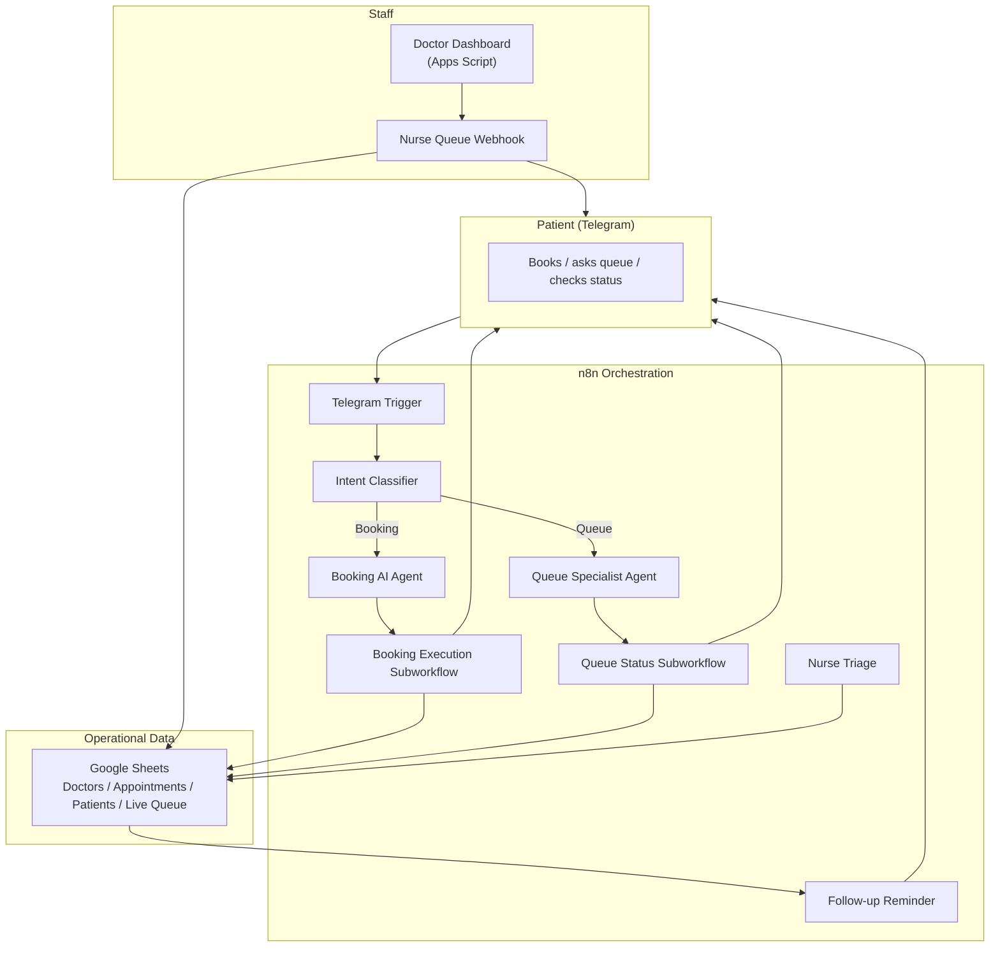

# Ye Htet Soe

**AI Automation Specialist · n8n · LLM Agents · Workflow Systems**

I design and deploy end-to-end AI agents that handle real business operations — patient bookings, queue management, sales conversations, and payment verification — using low-code orchestration, LLMs, and messaging platforms.

---

## Featured Project: Hospital AI Assistant

A **conversational AI system for a smart clinic** that lets patients book appointments, check queue status, complete triage, and receive follow-up reminders entirely through a Telegram bot. It coordinates doctors, nurses, and patients in real time with Google Sheets as the operational data layer and a Google Apps Script doctor dashboard.

---

## Problem

Small-to-medium clinics in Myanmar struggle with:
- Manual appointment booking and phone-tag with staff
- Long, unmanaged waiting rooms with no visibility for patients
- Paper triage forms and fragmented patient records
- Missed follow-ups and medication reminders
- No simple queue dashboard for doctors and nurses

## Solution

A multi-agent Telegram bot backed by **n8n**, **Gemini 2.5 Flash** (via OpenRouter), **Google Sheets**, and **Google Apps Script** that automates the full patient journey.

---

## Key Features

- **AI appointment booking** — natural-language conversation in Burmese, English, or Chinese. Collects patient name, phone, symptom, doctor, and date, then validates slot availability.
- **Dynamic roster & slot validation** — live 14-day calendar computed from doctor availability and current bookings.
- **Intent classification** — a dedicated LLM agent routes each message to *Booking*, *Queue*, or *Human/Admin* flow.
- **Queue management** — nurses advance the queue; patients receive 30-min and 60-min turn alerts plus a "Your turn" message.
- **Triage intake** — patients scan a generated QR code to submit vitals, which are appended to their record.
- **Doctor dashboard** — a Google Apps Script web app lets doctors view scheduled and checked-in patients, add instructions and follow-up dates, and complete consultations.
- **Automated follow-ups** — daily 9 AM cron sends medication reminders (1 day post-visit) and 2-week follow-up check-ins.
- **Human handover** — admin escalation via Telegram when the agent cannot handle a request.

---

## Tech Stack

| Layer | Tools |
|-------|-------|
| **Automation platform** | n8n (native nodes + LangChain nodes) |
| **LLM** | Gemini 2.5 Flash via OpenRouter |
| **Memory** | n8n Window Buffer Memory per Telegram chat ID |
| **Messaging** | Telegram Bot |
| **Database / source of truth** | Google Sheets |
| **Doctor dashboard** | Google Apps Script + HTML/CSS/JS |
| **Web dashboard** | Next.js 14 + Supabase (`/web`) |
| **Languages** | JavaScript, HTML, CSS, PL/pgSQL |

---

## n8n Workflows Included

All import-ready workflow JSON files are in [`workflows/`](workflows/):

| Workflow | Purpose |
|----------|---------|
| `Hospital Main Workflow v3.json` | Main Telegram trigger, intent classification, booking & queue agents, follow-up scheduler, nurse queue webhook, patient alerts |
| `Booking Execution Subworkflow.json` | Validates doctor, date, and slot capacity; appends confirmed appointment and sends QR code |
| `Queue Status Subworkflow.json` | Computes current token position, wait time, and turn status for patients |
| `02 - Nurse Triage (Vitals Update).json` | Records patient vitals, updates appointment status to `Checked-in`, and notifies the patient |
| `03 - Doctor Dashboard (Google Sheets Web App).json` | Webhook endpoint for doctor completion; advances queue and alerts the next patient |
| `Follow-up Reminder.json` | Daily scheduled reminders for medication (1 day) and follow-up (14 days) |

Legacy dashboard code is in `Code.gs` and `Index.html`; a Next.js + Supabase version is in `/web`.

---

## Impact

- **Reduces front-desk workload** by automating booking, queue updates, and triage collection.
- **Cuts patient wait-time uncertainty** with real-time queue status and proactive alerts.
- **Improves follow-up adherence** with automated medication and check-in reminders.
- **Gives doctors a one-page dashboard** to complete consultations and advance queues without manual coordination.

---

## Setup (High Level)

1. Create an n8n instance and import the `workflows/*.json` files.
2. Configure credentials: Telegram Bot, Google Sheets OAuth2, OpenRouter API.
3. Create the Google Sheets tabs: `Doctors`, `Appointments`, `Patients`, `Live_Queue`.
4. Deploy the Apps Script dashboard (`Code.gs` + `Index.html`) and set the `N8N_WEBHOOK_URL` script property.
5. For the Next.js dashboard, run `cd web && npm install && npm run dev` after setting up Supabase (see `web/README.md`).

---

## Skills

- **AI / LLMs**: Prompt engineering, agentic tool-calling, intent classification, memory management
- **Automation platforms**: n8n, Make/Zapier patterns
- **Messaging bots**: Telegram, Facebook Messenger webhooks
- **Data orchestration**: Google Sheets, Google Apps Script, Supabase
- **Web**: Next.js, React, JavaScript, HTML/CSS
- **Workflow design**: Subworkflows, error handling, admin handover, cron scheduling

---

## Get In Touch

- GitHub: [@yehtet-dev](https://github.com/yehtet-dev)
- Telegram: [@kiran_soe](https://t.me/kiran_soe)
- LinkedIn / Resume: available on request
